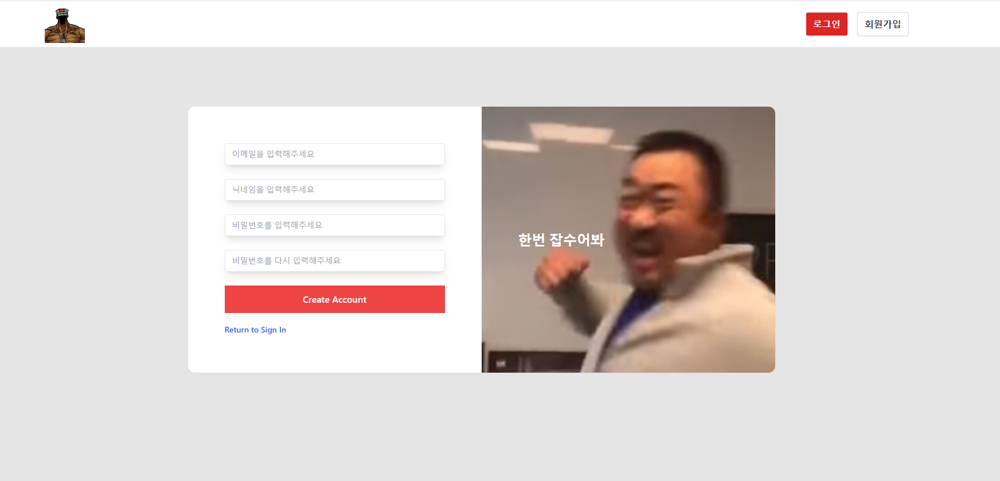
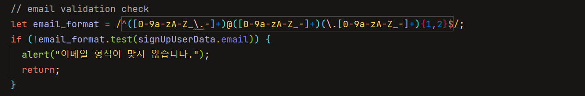
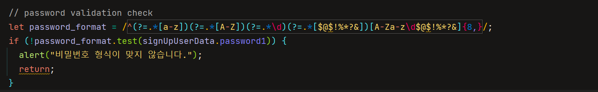

# 류원창 sub_pjt1
---

### 비로그인 상태
- 우상단에
- 회원가입 페이지로 이동할 수 있는 버튼이 존재한다.
- 로그인 페이지로 이동할 수 있는 버튼이 존재한다.
- 페이지 이동은 리액트 라우터를 이용한다.

#### 회원가입 페이지

- 회원가입 버튼을 누르면 필드에 대한 유효성 검사를 한다.
- 이메일에 대한 유효성 검사는 다음과 같은 코드로 구현한다.
  
- 비밀번호 규칙 
  - 최소 8자리 이상 : 영어 대문자, 소문자, 숫자, 특수문자 중 2종류 조합
- 비밀번호에 대한 유효성 검사는 다음과 같은 코드로 구현한다.
  
